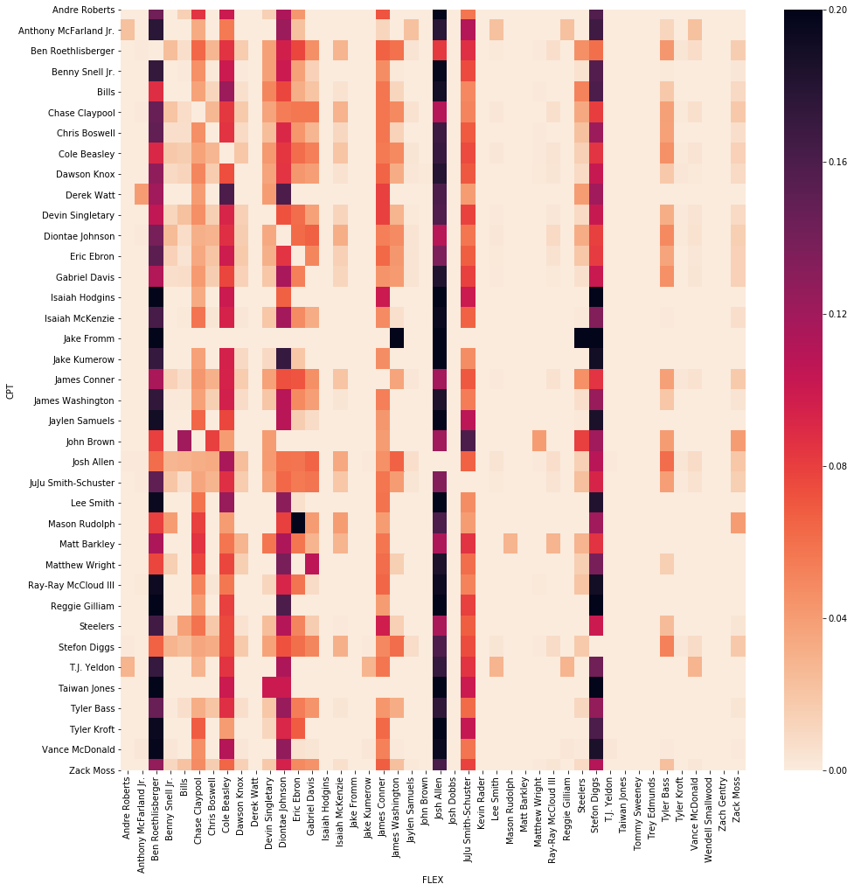
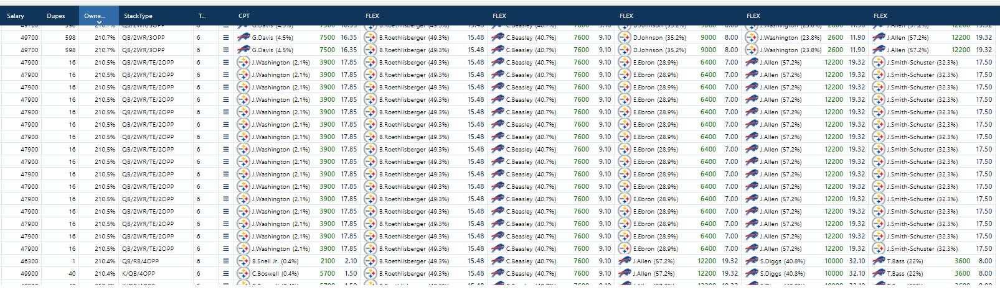
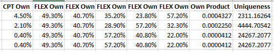

title:  The Fallacy of Cumulative Ownership
date: 2020-12-14
category: DFS
authors: Blaine

**As** the "field" in daily fantasy sports continues to get sharper and better at the game, I've seen a lot more people worried about the amount of ownership their lineup has. The reasons for this are pretty obvious: the greater the ownership, the more likely it is that your lineup is duplicated and having a duplicated lineup in a top heavy contest (like all the big GPPs are nowadays) is very bad, for reasons I'm not going to get in to here. This is especially true in small slates and showdown contests, where contests will hand out 500,000 dollars to first place and 150,000 to second. 

While it's good that players are concerned with the amount of ownership their lineup has, it's bad the key number they're usually concerned about is the cumulative ownership of their lineup. To me this is a very obvious mistake in understanding probabilities that ends up being a -EV way to look at lineup building. Let's go on a trip back to the most basic probability rules: the Addition rule and the Multiplication rule.

The Addition Rule states that: 
    P(A or B) = P(A) + P(B)

Another way to think about ownership percentages is simply: what is the probability that the player is in a random lineup in a contest?. The Addition Rule is telling us then that when we add ownership percentages together we're merely calculating the probability that a lineup has player A *OR* player B *OR* player C, and so on[^1]. The number we are really after is the probability that a random lineup contains player A *AND* player B *AND* player C, and so on. 

This brings us to The Multiplication Rule:
    P(A and B) = P(A) * P(B)
    
[^1]: This isn't even technically correct because these events are non-mutually exclusive events, which is what players in a lineup are. We should be using P(A or B) = P(A) + P(B) - P(A|B)

It's important to note that the Multiplication Rule assumes that events are independent so we need to get an idea of how much intercorrelation we find within lineups. I expect that there is some -- most lineups with a quarterback at captain won't take the other team's defense and probably will include a receiver or tight end, for example -- but I don't expect it to be so drastic that it ruins our independence assumption in contests with many lineups. In lieu of calculating the relationship between every captain and every flex roster spot, let's look at only the relationship between captain plays and flex plays from the main Draftkings Showdown contest for Bills-Steelers last Sunday to get an idea of how much dependence there is in each lineup: 


```python
import pandas as pd 
import seaborn as sns
import matplotlib.pylab as plt
import os
import scipy.stats as ss
import numpy as np


os.chdir('C:\\users\\cloud\\documents\\nfl')   

sd = pd.read_csv('dk sd.csv')
sd.columns = sd.columns.str.lower()
own = pd.read_csv('sd ownership.csv')
own.columns = own.columns.str.lower()

flex = sd['lineup'].str.split('FLEX|CPT', expand = True)

flex.columns = ['NA', 'FLEX1', 'FLEX2', 'FLEX3', 'FLEX4', 'FLEX5', 'CPT']

flex= flex[['FLEX1', 'FLEX2', 'FLEX3', 'FLEX4', 'FLEX5', 'CPT']]

flex['id'] = flex.index

keys = [c for c in flex if c.startswith('FLEX')]

cpts = pd.melt(flex, id_vars='CPT', value_vars=keys, value_name='FLEX')
cpts = cpts.dropna()

cpts['CPT'] = cpts['CPT'].str.strip()
cpts['CPT'] = cpts['CPT'].astype('category')
cpts['FLEX'] = cpts['FLEX'].str.strip()
cpts['FLEX'] = cpts['FLEX'].astype('category')

m = pd.crosstab(cpts["CPT"], cpts["FLEX"])
m = pd.crosstab(cpts["CPT"], cpts["FLEX"])
##dividing # of lineups by the total # of lineups with that player as captain
m_div = m.div(m.sum(axis=1), axis=0)

plt.figure(figsize=(16, 16))
sns.heatmap(m_div, cmap='rocket_r',fmt='g')
plt.show()
```




The heatmap above shows that there's definitely some relationship between the plays -- Josh Allen as a Flex play is least owned when the Steelers Defense was picked as a Captain for example. Using the chi-square test we can confirm this hypothesis:


```python
stat, p, dof, expected = ss.chi2_contingency(m)
print('dof=%d' % dof)
print(expected)
# interpret test-statistic
prob = 0.95
critical = ss.chi2.ppf(prob, dof)
print('probability=%.3f, critical=%.3f, stat=%.3f' % (prob, critical, stat))
if abs(stat) >= critical:
	print('Dependent (reject H0)')
else:
	print('Independent (fail to reject H0)')
# interpret p-value
alpha = 1.0 - prob
print('significance=%.3f, p=%.3f' % (alpha, p))
if p <= alpha:
	print('Dependent (reject H0)')
else:
	print('Independent (fail to reject H0)')
```

    dof=1591
    [[2.69012493e-02 5.01382088e-02 6.91263797e+00 ... 1.25122090e-03
      8.93729213e-05 1.05844351e+00]
     [3.45873205e-02 6.44634114e-02 8.88767739e+00 ... 1.60871258e-03
      1.14908042e-04 1.36085594e+00]
     [2.99603057e+01 5.58396394e+01 7.69870366e+03 ... 1.39350259e+00
      9.95358992e-02 1.17880365e+03]
     ...
     [6.72531233e-02 1.25345522e-01 1.72815949e+01 ... 3.12805224e-03
      2.23432303e-04 2.64610877e+00]
     [3.15128920e-01 5.87333304e-01 8.09766162e+01 ... 1.46571591e-02
      1.04693994e-03 1.23989097e+01]
     [2.11559111e+00 3.94301200e+00 5.43629600e+02 ... 9.83995863e-02
      7.02854188e-03 8.32390215e+01]]
    probability=0.950, critical=1684.908, stat=127478.547
    Dependent (reject H0)
    significance=0.050, p=0.000
    Dependent (reject H0)
    

So the chi-square test does reveal that there is some dependent relationship between Captains and Flex plays. I do not think that this is exactly breaking news. But how much of an relationship is there? We can use [Cramer's V](https://en.wikipedia.org/wiki/Cram%C3%A9r's_V) to get an idea of the strength of assocation:


```python
def cramers_v(x, y):
    confusion_matrix = pd.crosstab(x,y)
    chi2 = ss.chi2_contingency(confusion_matrix)[0]
    n = confusion_matrix.sum().sum()
    phi2 = chi2/n
    r,k = confusion_matrix.shape
    phi2corr = max(0, phi2-((k-1)*(r-1))/(n-1))
    rcorr = r-((r-1)**2)/(n-1)
    kcorr = k-((k-1)**2)/(n-1)
    return np.sqrt(phi2corr/min((kcorr-1),(rcorr-1)))


cramers_v(cpts['CPT'], cpts['FLEX'])
```


    0.06591051947226986


In this case, the Cramer's V value is so low (similar to the typical Pearson's correlation coefficient, Cramer's V has a value range of 0 to 1) that although we acknowledge that there is *some* relationship in the data between between choosing Captains and Flex plays, it's low enough that we can assume that we can mostly calculate a lineup's independence using the Probability Rule. Consider the below lineups with almost the exact same cumulative ownership (thank you FC!): 



Now instead of looking at the cumulative ownership, let's look at the ownership product for each lineup:



The raw differences in the ownership product seem pretty minute, but converting them back to a fraction gives a better idea of the magnitude of differences between the probabilities of each lineup being duplicated. Another way to read that last column is for the first lineup you'd expect a duplicate for every 2311 lineups. 

Another thing to note is that despite having the same ownership product, the Benny Snell lineup is unique and the Boswell lineup isn't, which is probably due to the difference in total salaries (the Snell lineup used $46,300 in salary). This is yet another way to get unique -- if you're considering two lineups with the same projection, same ownership product, and different salaries, you should always take the lineup with the lowest salary. 

**Key takeaways:**
    
1. Building unique lineups in DFS is vitally important
2. Math you learned in high school and probably complained you'd never use again can, in fact, be used again
3. Small slate lineups aren't strictly independent, however the association is low enough that ownership product can be used as a proxy for lineup uniqueness.
4. Instead of using cumulative ownership as a filter, consider using ownership product
5. Use cumulative salary to make lineups further unique
